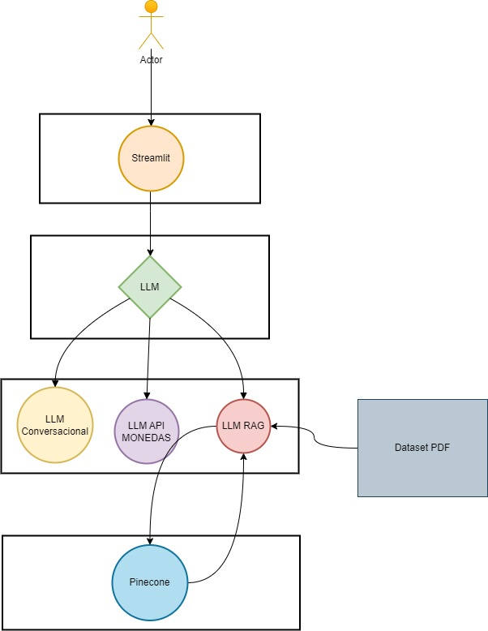

# Chatbot-Gemini

## spanish

Como introducción general este proyecto se basa en la creación de un agente inteligente, usando Gemini como LLM.

1. Para esta implementacion utilice el patron de diseño repository, ya que se tienen 3 agentes.

- El primer agente contesta preguntas generales.
- El segundo agente consume una api para recibir la TRM de pais [API](https://www.exchangerate-api.com/docs/pair-conversion-requests).
- El tercer agente consume un RAG cargado en [Pinecone](https://www.pinecone.io/) y al momento de brindar respuestas se enfoca en los datos vectorizados previamente.

2. Para instanciar cada repository dependiendo del agente necesario, cree un angete el cual tiene la tarea de clasificar las preguntas dependiendo el agente especializado, aqui te dejo un diagrama de como seria:

3. Como se puede observar en el diagrama el actor usara una interfaz creada con [Stramlit](https://streamlit.io/), la cual instancia una aplicación que nos permitira interacturar de manera escrita con los agentes nombrados.

### Consideraciones

1. Como libreria para generar embeddings se utilizó el modelo [paraphrase-multilingual-MiniLM-L12-v2](https://huggingface.co/sentence-transformers/paraphrase-multilingual-MiniLM-L12-v2) de Hugging Face.

2. Para utilizar Gemini es necesario descargar el google SDK, ya que se necesita generar autenticación cada que se realiza el cargue del proyecto, por el tema de las variables usadas en un proyecto en [GCP](https://cloud.google.com/?utm_source=google&utm_medium=cpc&utm_campaign=na-US-all-en-dr-skws-all-all-trial-b-dr-1707554&utm_content=text-ad-none-any-DEV_c-CRE_665665942492-ADGP_Hybrid+%7C+SKWS+-+MIX+%7C+Txt-Google+Cloud-Google+Cloud+General-KWID_43700077223807442-aud-1903314849966:kwd-12753646&utm_term=KW_cloud-ST_cloud&gad_source=1&gclid=Cj0KCQjwurS3BhCGARIsADdUH51Wmowa2t75UZOeRT48s1q-lRdn-vFonCZO6vOsIk3cA8iOdWd5ZUEaAi-yEALw_wcB&gclsrc=aw.ds&hl=es_419).

3. Para el punto anterior te dejo la pagina de google donde puedes encontrar el [SDK de Google](https://cloud.google.com/sdk/docs/install-sdk?hl=es-419).

4. Es necesario crear el archivo de ambiente, ya que sin dicho archivo no se podra utilizar, ya que el proyecto se configuro para utilizar variables de entorno.

5. Una vez instalado el SDK de Google y el archivo de ambiente, en la terminar sigue los siguientes comandos [comandos](run.sh).

    - Ten presente que el comando **gcloud auth login** generara una url para autenticarte con una cuenta de google la cual tenga permisos en el proyecto para ejecutarlo.

